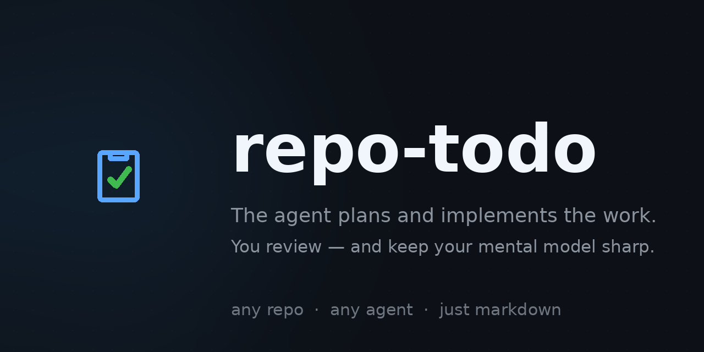

<div align="center">



# repo-todo

**A task board and planning format your AI agent can actually work from — in any repo, with any agent.**

The agent plans the work, then implements it. You review the plans — which is enough to keep your mental model of the codebase sharp — and one markdown board keeps you, the agent, and your future self on the same page.

[](LICENSE)


</div>

---

## Quick start

Two prompts. Plan in one session, execute in another:

```text
# Session 1 — planning
> use repo-todo: create a plan to implement rate limiting on the API

# Session 2 — execution (a fresh session saves your context window)
> use repo-todo: execute all open plans
```

In session 1, the agent studies your repo and writes structured plans into `.plans/`. You skim them over coffee — approve, correct, or send back. In session 2, a fresh agent with a clean context window works through the board while you do something else entirely.

## Why

Working with a coding agent has a failure mode you've probably hit: the agent loses the plot, you lose your place, and the "quick task" turns into an hour of re-explaining your own codebase.

repo-todo fixes the handoff:

1. **The agent does the planning.** It investigates the repo and writes each task as a short, structured plan — files to touch, acceptance criteria, verification commands — instead of free-styling from a chat message.
2. **You review instead of write.** Reading a one-page plan is enough to keep your mental model up to date. You stay the architect — correcting course before code exists — without doing the typing.
3. **You stay in flow.** Execution happens in a separate session while you plan the next task, work another repo, or take an actual break. The board holds the state, so nothing lives only in your head — or only in the agent's context window.

The board is the handoff. Because it's just markdown in the repo, it survives context resets, works across sessions, and diffs cleanly in code review.

## What it is

Two small files you drop into your repo (or your agent's skill/instructions directory):

| File | Purpose |
|---|---|
| [`SKILL.md`](SKILL.md) | The agent-facing instructions: how to capture, claim, execute, block, and complete tasks |
| [`references/plan-template.md`](references/plan-template.md) | The plan template every task expands from (draft → ready) |

No runtime, no dependencies, no lock-in. It's a convention plus a precise instruction file any LLM agent can follow.

## The board

All state lives in `.plans/todo.md`. The structure is fixed so agents (and humans) can parse it at a glance:

```markdown
# Tasks

## Todo
| Priority | ID | Description / plan | Notes |
| --- | --- | --- | --- |
| P1 | T003 | Add retry with backoff to webhook sender — [plan](T003-webhook-retry.md) | draft |

## In Progress
| Priority | ID | Description / plan | Notes |
| --- | --- | --- | --- |
| P0 | T001 | Fix off-by-one in pagination — [plan](T001-pagination-fix.md) | owner=agent/codex; updated=2026-09-30T14:02Z |

## Blocked
| Priority | ID | Description / plan | Notes |
| --- | --- | --- | --- |
| P2 | T004 | Migrate config format — [plan](T004-config-migration.md) | blocked on T002; unblock: land config parser |

## Done
| Priority | ID | Description / plan | Notes |
| --- | --- | --- | --- |
| P1 | T002 | Upgrade to foo v2 — [plan](T002-foo-v2.md) | completed=2026-09-29 |
```

### Task states

| State | Meaning | Entry rules |
|---|---|---|
| **Todo** | Ready to be picked up, in priority order (`P0` urgent failure → `P2` normal) | Has a plan file, even if it's a draft |
| **In Progress** | Claimed by exactly one owner | Notes must contain `owner=<agent/session>; updated=<UTC timestamp>` |
| **Blocked** | Cannot proceed; the reason and unblock action are explicit | Notes name the blocker and the concrete unblock step |
| **Done** | Every acceptance criterion verified against evidence | Notes carry `completed=YYYY-MM-DD`; regressions reopen under the same ID |

Every task gets an **immutable ID** (`T001`, `T002`, …) that is never reused or renumbered — plan filenames carry the ID (`T001-pagination-fix.md`), so links survive reordering, and history stays traceable. One row per task, in exactly one section, always.

## Draft plans: capture now, think later

Good ideas shouldn't wait for full designs. When the *what* is clear but the *how* isn't yet, record a **draft** plan:

```markdown
# T003: Add retry with backoff to webhook sender
Readiness: draft

MUST BE FLESHED OUT BEFORE IMPLEMENTATION.

## Request
Webhook deliveries fail silently on transient 5xx. We lose events.

## Missing before ready
- Which failures are retryable vs. permanent?
- Where does the backoff state live? Delivery table or in-memory?
- Acceptance criteria for "delivered exactly once, observably".
```

A **ready** plan is executable without guessing requirements: concrete acceptance criteria, an implementation overview a human reviewer can follow at a glance, and verified verification steps. Before implementing anything, the agent expands drafts to ready — never codes from a draft.

This draft → ready gate is the quality control: cheap to capture an idea mid-flow, impossible for an agent to run off with a half-thought.

## The plan template, section by section

Every plan — draft or ready — uses one template. Each section earns its place:

| Section | Why it exists |
|---|---|
| **Readiness: draft / ready** | A machine-checkable gate. Agents must never implement from a `draft`; the flag makes that rule enforceable at a glance. |
| **Request** | The problem and desired outcome, recorded in the plan itself — no agent ever has to reconstruct intent from chat scrollback. |
| **Missing before ready** (drafts only) | Forces unknowns to be explicit *before* work starts. "We'll figure it out as we go" is where implementations go wrong. |
| **Outcome and scope** | Observable desired behavior plus explicit exclusions. Scope creep and "while I'm in here" refactors die here. |
| **Context and prerequisites** | Verified files, symbols, and dependencies, linked to real source. This is what makes a plan self-contained and resumable by a fresh agent in a new session. |
| **Acceptance criteria** | Concrete, checkable "given X, when Y, then Z" statements — the definition of done. Vague plans produce vague results; criteria map 1:1 to verification. |
| **Implementation overview** | The human-reviewable summary: strategy, architectural changes, design decisions. A reviewer grasps the whole approach in a minute — this is the section that keeps *your* mental model current. |
| **Implementation steps** | Small, independently verifiable increments, written so a junior agent can follow them — because that's literally who follows them. |
| **Verification** | The exact command, working directory, and expected result for each criterion. Evidence over claims: "it works" is not a result. |
| **Risks and recovery** | Material risks, mitigations, and rollback — decided before destructive or schema-changing work, not after. |
| **Progress and handoff** | A running log of completed steps, evidence, and the specific next action. Any agent — or you, a week later — can resume mid-task without archaeology. |

The template is deliberately proportional: a one-line fix gets a two-line plan; an architecture change gets full criteria, risks, and rollback. Right-size the ceremony, keep the sections.

## Claiming and locking

Multiple agents (or an agent plus you) can share one repo without stepping on each other:

- **Claiming** a task = moving its row to *In Progress* with `owner=...; updated=...` in Notes. The owner field is a convention, not a lock — but the rule is absolute: **never take another active owner's item without an explicit handoff.**
- **Serialized writes:** when several agents run concurrently, board edits go through one coordinator. Re-read the board immediately before editing; preserve other agents' rows.
- **Post-write invariants:** unique IDs, valid priorities, existing plan links, exactly one row per task — checked after every update.
- **Boards are checkout-local** (`.plans/` is gitignored by convention), so parallel worktrees each get a coordinator board and hand off plans explicitly.

## "Do all the tasks" mode

The workflow that makes the whole thing pay off. When you tell the agent to execute all open plans, it works the board one item at a time, in priority order:

1. **Delegate** — claim the item, launch exactly one implementation subagent, and block until it reports. Drafts get expanded to ready first.
2. **Verify** — review the subagent's diff and run the plan's acceptance checks itself.
3. **Commit** — commit task + board + plan updates with a repo-style message, then move to the next item.

The reason behind this structure is **context-window economics**. The orchestrating agent offloads actual implementation to subagents, so implementation burns *their* context, not its own. The orchestrator only has to read diffs and run checks — a fraction of the token cost — which lets it drive through the whole board in one session without degrading.

And like a good manager, it deals with what comes back: if a subagent hit problems, it fixes or unblocks them directly; if the task surfaced new work, it doesn't drop it — it files new Todo rows with draft plans before moving on. Nothing discovered mid-task evaporates.

Because verification and committing are separated from implementation, you also get clean per-task commits and an audit trail — and because it's one subagent at a time, you never get five half-finished features.

## Installation

### Just ask your agent (recommended)

Any coding agent that can follow a URL can install it. Say:

```text
install the github.com/smhanov/repo-todo skill
```

The agent fetches the repo, puts the instructions where it can find them, and creates `.plans/` in your project. Works with Claude Code, Codex, Cursor, OpenCode, Hermes, or any agent that reads files and follows instructions.

### Or install it by hand

```bash
# in your repo root
mkdir -p .plans
curl -o .plans/AGENT_INSTRUCTIONS.md https://raw.githubusercontent.com/smhanov/repo-todo/main/SKILL.md
curl -o .plans/plan-template.md https://raw.githubusercontent.com/smhanov/repo-todo/main/references/plan-template.md

# keep plans local to the checkout (recommended)
grep -qxF '/.plans/' .gitignore || echo '/.plans/' >> .gitignore
```

Then point your agent at `.plans/AGENT_INSTRUCTIONS.md`, ask for your first plan, and say **"execute all open plans."**

### Or clone it into a skill directory

If your agent supports skill directories (Hermes, OpenCode, and others):

```bash
git clone https://github.com/smhanov/repo-todo ~/.config/opencode/skills/repo-todo
```

## Tips

- **Keep the board honest.** The board is authoritative for status — if it's not on the board, it doesn't exist. Record newly discovered work as new rows immediately.
- **Review plans, not just results.** The implementation overview and acceptance criteria are written for you — a one-minute skim before saying "go" is the highest-leverage minute in the workflow.
- **Plans are self-contained.** They link real files and symbols, verify commands exist, and never invent paths or test results. Future-you (and future agents) depend on it.
- **Preserve done rows.** Completed tasks and their plans are the project's decision log — keep them.

## License

[MIT](LICENSE) — use it in any repo, with any agent.
